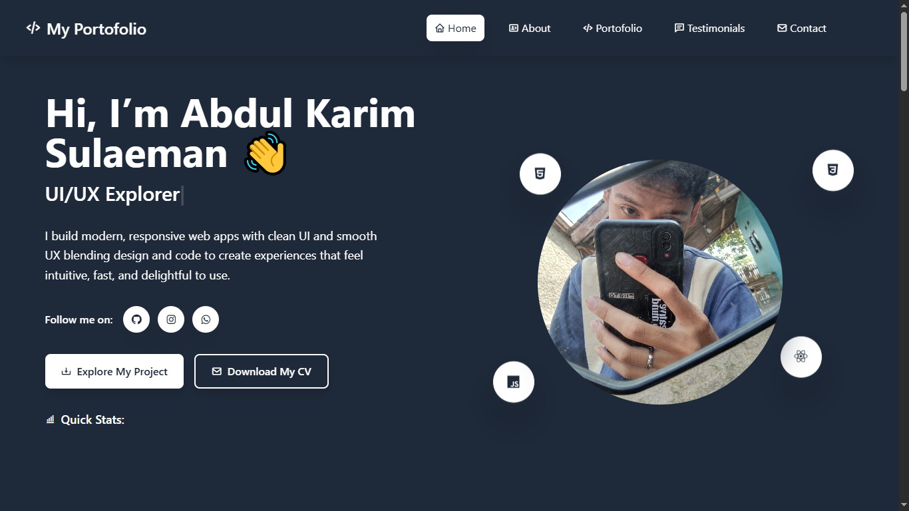

# Eclipse-Portfolio — Interactive Developer Portfolio Website

**Eclipse-Portfolio** is a modern and interactive personal portfolio website designed to showcase projects, skills, and achievements in a visually appealing way. Built with cutting-edge tools for smooth animations, clean design, and a delightful user experience.

### 🌐 Live Demo
[Check it out here → ](https://my-portfolio-phi-ten-48.vercel.app/)



---

## 🛠 Tech Stack
- **Framework**: React + Vite
- **Styling**: Tailwind CSS
- **Animations & Interactions**:
  - AOS (Animate On Scroll)
  - Tippy.js (Tooltips)
  - SweetAlert (Custom Alerts)
- **Backend / Database**: Supabase
- **Build Tool**: Vite for lightning-fast development

---

## ✨ Features
- **Clean & Responsive Design**: Optimized for all screen sizes.
- **Smooth Scroll Animations**: Powered by AOS for a dynamic experience.
- **Interactive Elements**: Tooltips and alert modals for better engagement.
- **Dynamic Data Handling**: Using Supabase for real-time database integration.
- **Optimized Performance**: Built with Vite for fast load and dev speed.

---

## 📂 Project Highlights
- Fully responsive design for desktop and mobile.
- Organized codebase with reusable components.
- Interactive UI elements for better user engagement.
- Minimal yet modern design using Tailwind utilities.

---

### ▶ How to Run Locally
1. Clone the repository:
   ```bash
   git clone git@github.com:karimm1620/my-portfolio.git
   cd my-portfolio
   
2. Install dependencies:
   ```bash
   npm install

3. Start the development server:
   ```bash
   npm run dev

4. Open http://localhost:5173
 in your browser.
  
